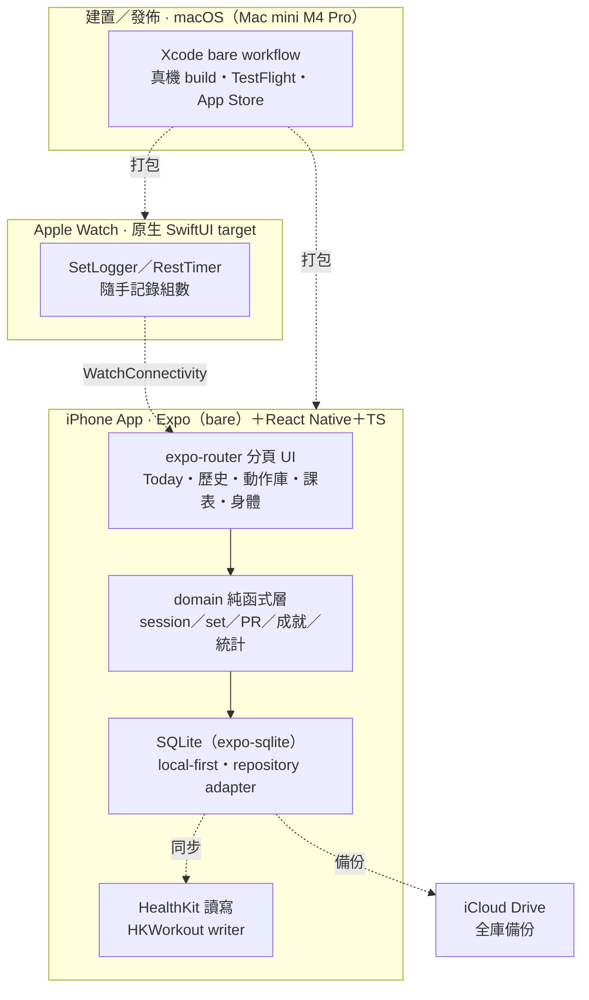

# TrainingLog — iOS 重量訓練紀錄 App

個人用的 iOS 重量訓練紀錄 App，長期目標上架 App Store。以 **Expo（bare workflow）＋React Native＋TypeScript** 開發：expo-router 分頁 UI、純函式 domain 層與 **SQLite（expo-sqlite）local-first** 儲存分離（repository adapter，以 30 篇 ADR 記載設計取捨）。含**原生 Apple Watch（SwiftUI）**隨手記錄＋WatchConnectivity 同步、**HealthKit** 讀寫（HKWorkout writer）與 iCloud Drive 全庫備份。跨平台建置與發佈走 Mac／Xcode（bare workflow 真機 build、TestFlight、App Store）。自學／作品集專案。

## 系統架構

App 主體跑在 iPhone（Expo bare workflow）：畫面用 expo-router 分頁導航，商業邏輯是可在 node 環境測試的 **domain 純函式層**，資料經 repository adapter 落在本機 **SQLite**（local-first、離線可用），並與 HealthKit 雙向同步、以 iCloud Drive 做整庫備份。**Apple Watch** 是獨立的原生 SwiftUI target，在健身房隨手記錄組數後經 WatchConnectivity 同步回 iPhone。原生打包、上架與 Watch app 建置都在 **Mac／Xcode** 上完成。



- **裝置**：iPhone App、Apple Watch（原生 SwiftUI，隨手記錄後經 WatchConnectivity 同步回 iPhone）
- **App 內**：expo-router 分頁 UI、domain 純函式層、SQLite local-first 儲存（repository adapter）、HealthKit 讀寫
- **建置／外部**：Mac／Xcode bare workflow（真機 build＋發佈）、iCloud Drive 全庫備份

## 技術棧

- **框架**：Expo SDK（bare workflow）、React Native、TypeScript、expo-router
- **資料**：SQLite（expo-sqlite，local-first）、domain／adapter／services 分層、30 篇 ADR
- **原生整合**：Apple Watch（SwiftUI target ＋ WatchConnectivity）、HealthKit、iCloud Drive 備份
- **平台／發佈**：macOS ／ Xcode、TestFlight、App Store（Apple Developer Program）

## 開發

```bash
npm install
npx expo start     # 開發（bare workflow：Xcode build 到真機，見 CLAUDE.md）
npm test           # jest（node env，測 domain / adapter 純邏輯）
```

架構決策見 `docs/adr/`、領域索引見 `CONTEXT.md`。

## 授權

程式碼採 [MIT License](LICENSE)。研究／作品集用途。
